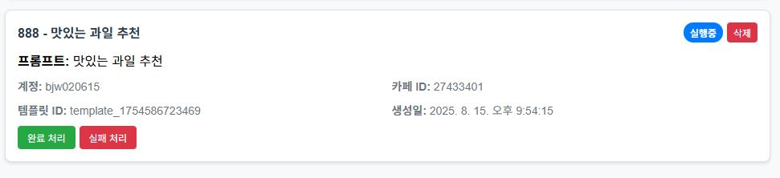

# 사용 방법

네이버 카페 매크로 프로그램의 사용 방법을 설명한 문서입니다.

## 기본 구조

네이버 카페 매크로 프로그램의 구조는 다음과 같습니다.

```text
계정 등록 > 카페 등록 > 상품 등록 > 글 생성 > 작업 등록
```

계정과 연결된 카페와 카페 게시판이 있고, 그 카페 게시판에 상품을 등록하여 상품에 해당하는 글을 생성한 후 자동 매크로 작업 등록이 가능하며, 여러 개의 계정을 한번에 제어할 수 있는 기능을 제공합니다.

> **:) 다음 매뉴얼을 순차적으로 수행하기를 추천합니다.**

## 1. 계정 등록

> 상단 메뉴바에서 **"로그인"** 메뉴를 클릭합니다.

1. **로그인 창 열기 버튼을 클릭**하면 계정을 추가할 수 있습니다. **로그인 창 열기 버튼을 클릭**합니다.
   

2. 로그인 창 열기 버튼을 클릭하면 "로그인 중" 으로 바뀌며, **네이버 로그인 창이 생성**됩니다.
   
   이 창에서 네이버 로그인을 하면 세션 키가 자동으로 등록되며, 창이 닫힙니다.
   

3. **로그인이 완료**되면 다음과 같이 변경됩니다.
   
   로그인 아이디가 자동으로 캡쳐되지 않아 **"아이디를 입력하세요"** 라는 메시지가 존재할 경우, **직접 메시지를 눌러 텍스트를 변경**합니다.
   
   

4. 이제 아래 사진과 같이 **성공적으로 계정이 등록**되었습니다.
   

## 2. 카페 등록

> 상단 메뉴바에서 **"카페목록관리"** 메뉴를 클릭합니다.

1. "계정 추가" 에서 등록한 계정에 카페를 연결합니다. "슬롯 선택"에서 계정을 선택하고 향후 작성을 원하는 **카페 게시판의 URL을 붙여넣습니다.**
   

2. 카페명과 카페 게시판의 이름을 붙입니다. **선택사항**으로 굳이 하지 않아도 되지만, 여러 개의 계정을 관리할 때 이름을 적어두면 **사용하기 편리**합니다.
   

3. 다음과 같은 화면이 표시되면, **성공적으로 계정이 등록**된 것입니다.
   

## 3. 상품 등록

> 상단 메뉴바에서 **"글쓰기"** 메뉴를 클릭합니다.

1. **'슬롯 선택'**에서 계정을 선택합니다.
   

2. **"스마트 에디터 열기" 버튼**을 누르면 **상품을 등록**할 수 있습니다.
   

3. 네이버 카페 글쓰기 화면이 나옵니다. 이 화면에서 **상품등록을 위한 대표사진**, 가격, 배송 정보 등 상품에 대한 모든 정보를 작성합니다. 이때 상품 정보가 누락되면 추후 오류가 생기니 모든 정보를 제대로 입력하였는지 주의하세요.
   

   정보 입력이 끝나면, **"임시저장" 버튼을 클릭**합니다. 창이 자동으로 종료됩니다.
   

4. **"계정 선택 및 상품 필터링"** 섹션의 **"슬롯 선택" 드롭다운**을 클릭하면 등록된 상품이 표시됩니다.
   
   **캡처된 상품 목록 중 하나를 클릭**하면 **글을 생성**할 수 있습니다.
   

## 4. 글 생성

> 상단 메뉴바에서 **"글쓰기"** 메뉴를 클릭합니다. OpenAI API 키 설정에서 키가 등록되지 않았음이 표시될 경우 매뉴얼 6번으로 이동하세요.

1. **원하는 글감**을 입력합니다. **키워드**로 제시하면 되며, 자세하고 구체적인 제약조건이 있을 경우 **해당 조건들을 모두 입력**합니다.
   

2. 글감을 입력하고, **"해당 프롬프트로 작업 만들기" 버튼을 클릭**합니다.

## 5. 작업 등록

> 상단 메뉴바에서 **"작업 관리"** 메뉴를 클릭합니다.

1. 작업 관리 메뉴에 들어가면, 앞서 **상품과 글감을 활용**해 **생성한 작업을 확인**할 수 있습니다. 이 작업은 **예약 대기 상태**로, 작업을 시작하기 전까지는 실제로 카페에 작성이 되지 않습니다.
   
   

2. **"설정 편집"** 버튼을 클릭합니다.
   
   클릭하면, **아래와 같은 화면**이 표시됩니다. 이 화면에서는 **시작 시간, 글 작성간 지연시간** 등을 조절할 수 있습니다.
   

3. **원하는 설정**대로 **시작 시간과 지연 시간, 글 수**를 입력합니다. 딜레이가 **60분** / 글감 수가 **6개** / 시작 시간이 **10시**라면, **10시, 11시, 익일 0시, 1시, 2시, 3시**에 글이 작성되게 됩니다. **"저장" 버튼을 눌러 설정을 저장**합니다.
   

4. 이제 **"작업 시작" 버튼**이 표시됩니다. 이 버튼을 누르면 **작업이 성공적으로 예약**됩니다.
   

5. 성공적으로 작업이 예약되면 다음과 같은 표시가 뜨며 **실행중**이라는 태그가 표시됩니다.
   

## 6. 각종 설정 및 기타

> 상단 메뉴바에서 **"설정"** 메뉴를 클릭합니다.

1. 설정 메뉴에서 OpenAI 키와 글로벌 프롬프트를 수정할 수 있습니다. 글로벌 프롬프트란 전체적인 프로그램의 "글 생성" 부분에 있어 GPT에게 제공하는 지침입니다.
   OpenAI 키는 OpenAI 홈페이지를 확인하세요. 이 부분이 비어 있다면, 프로그램을 사용할 수 없습니다. "API 키가 설정되었습니다" 부분을 확인하세요.
   

2. OpenAI 키는 사용할수록 소모됩니다. 꾸준히 금액을 채워주어야 하므로, 다음 유튜브 링크를 참고하세요.
   <https://www.youtube.com/watch?v=uObDQxwMwpk>
